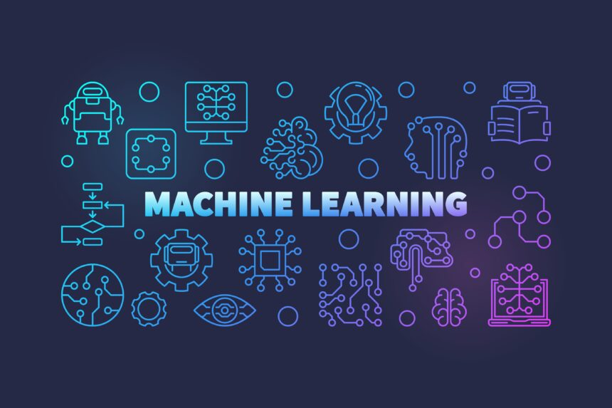
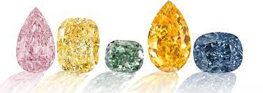
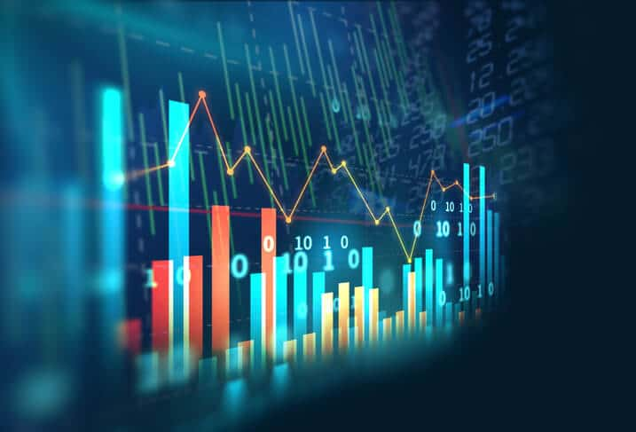

# Kaggle diamond competition
---

---
# Introducción
En [Ironhack](https://www.ironhack.com/) han realizado una pequeña competición en [Kaggle](https://www.kaggle.com/competitions/diamonds-datamad1022/overview) de machine learning, donde todos los alumnos compiten por conseguir el mejor modelo predictivo de los precios de los diamantes en base a sus características. 💎💎

Obviamente la competición es abierta, por lo que no solo está limitado a los alumnos de Ironhack.

Ya hicimos un par de modelos anteriormente en el modelo, por que además quise ponerme un pequeño reto, que consiste en intentar automatizar mucho más este proceso mediante un buen pipeline. 💪💪

---
# Objetivos

- Realizar un buen EDA, donde se estudiará la naturaleza de nuestros datos, gestión de nulos y gestión de ouliers. 📊
- Preparar los datos para nuestro modelo, realizando normalización, estandarización y encoding si fuese necesario. 📉
- Entrenar diversos modelos y analizar sus métricas, quedándonos con el modelo que se ajuste más a nuestras preferencias. 💻
- Crear un pipeline o archivo soporte que me sirva para futuros modelos predictivos. 🧑‍🔧
- Y por último y no menos importante... ¡Ganar!🏆
---
# Pipeline

- El pipeline está compuesto de diversas funciones, donde en el futuro iré añadiendo más.

- Estas funciones en un futuro planeo juntarlas en una clase, para que haya más interactividad entre funciones.

- Las funciones son un poco complejas al principio, por lo que recomiendo leer bien su domunetación [aquí](https://github.com/XiangLinZ/Kaggle_diamond_competition/blob/main/src/soporte.py). 👈👈

---
# Proceso

### Este proyecto tiene como objetivo predecir el precio de diamantes a partir de características como el peso, la claridad, el color y el corte. A continuación, se detallan los pasos seguidos en este proyecto:

- Entendimiento del problema: Se analizó la competencia de Kaggle y se estudió la naturaleza del problema. Se identificó que se trata de un problema de regresión, ya que lo que queremos predecir es el precio.💰💰

- Exploración de los datos: Se analizaron las características de los datos y se estudió la distribución de las variables. Se identificaron posibles relaciones entre las variables y se buscaron posibles outliers.😯😯

En mi caso, hay bastantes datos agrupados cerca del Q3 y decidí quedarme esos datos.

- Preprocesamiento de los datos: Se realizaron diversas técnicas de preprocesamiento para preparar los datos para su uso en modelos de aprendizaje automático. Entre ellas se incluyen la eliminación de valores nulos, la codificación de variables categóricas y la normalización de las variables numéricas. Como enfoque, los nulos se han tratado mediante un proceso de Iterative Imputer, que el que se comparan los datos con el resto, para darles un valor semejante.

- Selección de modelos: Se seleccionaron varios modelos de regresión, entre ellos Decision Tree Regressor, Random Forest Regressor, Gradient Boosting Regressor y K-Nearest Neighbors Regressor. 🤔🤔

- Mejora de los modelos: Se aplicaron técnicas de mejora de modelos, como la validación cruzada y el ajuste de hiperparámetros. Se compararon los modelos y se seleccionó el mejor. 👍👍

- Entrenamiento y validación: Se entrenó varios modelos y se validó con un conjunto de datos de prueba. Se evaluó el rendimiento del modelo con las métricas de los diversos modelos. 📊📊

- Predicciones: Se usó el modelo para hacer predicciones en un conjunto de datos desconocido y se guardó el resultado en un archivo CSV, que posteriormente se subió a la competición de [Kaggle](https://www.kaggle.com/competitions/diamonds-datamad1022/overview).

---
# Mejor modelo

Las métricas de mi mejor modelo son:
- MSE:
- RMSE:
- R2:

Características especiales del modelo:
- Variables conservadas:
- Gestión de outliers:
- Estandarización:
- Modelo:
- Métricas del modelo:
---
# Herramientas
### He usado diversas herramientas en este proyecto con distintos fines, aquí enumero las herramientas, junto a una pequeña descripción de estas.

- [Numpy](https://numpy.org/): Es una biblioteca de Python para trabajar con matrices y arreglos multidimensionales.
- [Pandas](https://pandas.pydata.org/): Es una biblioteca de software libre para el lenguaje de programación Python destinada a manipulación y análisis de datos.

- [Matplotlib](https://matplotlib.org/): Es una biblioteca de Python para la generación de gráficos y visualizaciones.

- [Seaborn](https://seaborn.pydata.org/): Biblioteca de Python para la visualización de datos basada en matplotlib.

- [Random](https://docs.python.org/3/library/random.html): Una biblioteca de Python que permite trabajar con números aleatorios.

- [Pickle](https://docs.python.org/3/library/pickle.html): Biblioteca de Python que permite serializar y deserializar objetos de Python.

- [Tqdm](https://github.com/tqdm/tqdm): Es una biblioteca de Python para mostrar una barra de progreso en bucles y operaciones iterables.

- [Scikit-learn (sklearn)](https://scikit-learn.org/stable/) es una biblioteca de aprendizaje automático de código abierto para Python. Proporciona herramientas simples y eficientes para la minería y análisis de datos, así como para la construcción de modelos de aprendizaje automático y la evaluación de su rendimiento.